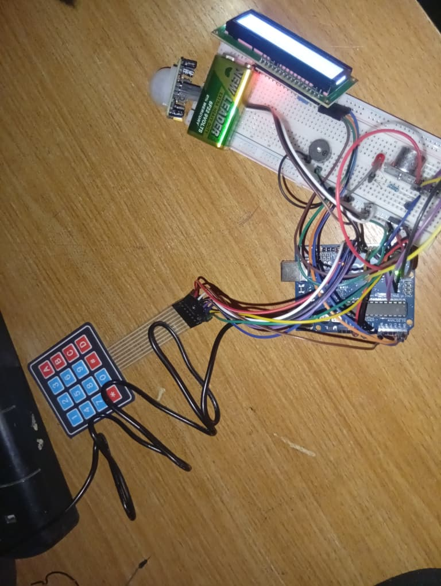

# 🔐 Arduino Smart Security System



### 🎥 Project Demonstration


[▶️ Watch the Project Demonstration](security-system-demo.mp4)
An Arduino-based smart security system prototype combining motion detection, distance sensing, keypad authentication, LCD monitoring, automatic lighting, and audible proximity alerts.

## 📌 Project Overview

This project was built using an Arduino UNO R3 as the central controller.

The system monitors its surroundings using a PIR motion sensor and an HC-SR04 ultrasonic distance sensor. A 4×4 membrane keypad provides PIN-based control for arming and disarming the system, while a 16×2 I2C LCD displays the current system status and sensor information.

When the system is armed, detected motion can activate an LED, while the ultrasonic sensor controls the behavior of the passive buzzer based on the detected distance.

The project was developed as a hands-on embedded systems and electronics learning project.

---

## ✨ Features

* 🔐 PIN-based ARM/DISARM system
* 🔢 4×4 membrane keypad interface
* 👤 PIR motion detection
* 📏 HC-SR04 ultrasonic distance measurement
* 💡 Automatic LED activation when motion is detected
* 🔊 Distance-based buzzer warnings
* 📺 16×2 I2C LCD status display
* 🖥️ Serial Monitor debugging
* 🧹 PIN entry clearing using `*`
* ✅ PIN submission using `#`

---

## 🧰 Hardware Components

| Component                  |    Quantity |
| -------------------------- | ----------: |
| Arduino UNO R3             |           1 |
| 16×2 I2C LCD               |           1 |
| 4×4 Membrane Keypad        |           1 |
| HC-SR04 Ultrasonic Sensor  |           1 |
| HC-SR501 PIR Motion Sensor |           1 |
| LED                        |           1 |
| Passive Buzzer             |           1 |
| Breadboard                 |           1 |
| Jumper Wires               | As required |

---

## 🔌 Pin Connections

### HC-SR04 Ultrasonic Sensor

| HC-SR04 | Arduino UNO |
| ------- | ----------- |
| VCC     | 5V          |
| GND     | GND         |
| TRIG    | D7          |
| ECHO    | D6          |

### PIR Motion Sensor

| PIR | Arduino UNO |
| --- | ----------- |
| VCC | 5V          |
| GND | GND         |
| OUT | D8          |

### LED

The LED is connected to **D5** through a current-limiting resistor.

### Passive Buzzer

| Buzzer | Arduino UNO |
| ------ | ----------- |
| +      | D4          |
| -      | GND         |

### 16×2 I2C LCD

| LCD | Arduino UNO |
| --- | ----------- |
| VCC | 5V          |
| GND | GND         |
| SDA | A4          |
| SCL | A5          |

### 4×4 Keypad

| Keypad | Arduino UNO |
| ------ | ----------- |
| R1     | D2          |
| R2     | D3          |
| R3     | D9          |
| R4     | D10         |
| C1     | D11         |
| C2     | D12         |
| C3     | D13         |
| C4     | A0          |

---

## 🔐 Keypad Controls

| Key | Function               |
| --- | ---------------------- |
| `A` | Start ARM procedure    |
| `B` | Start DISARM procedure |
| `*` | Clear PIN entry        |
| `#` | Submit PIN             |
| `D` | Display system status  |

The PIN is configured inside the Arduino sketch.

> **Note:** This is an educational prototype. The PIN should not be considered secure authentication for a real security system.

---

## ⚙️ How It Works

### 1. System Startup

When powered on, the LCD displays:

```text
SMART ROOM
SECURITY SYSTEM
```

The system then enters the disarmed state.

### 2. Arming

Press:

```text
A → PIN → #
```

If the correct PIN is entered, the LCD displays:

```text
ACCESS GRANTED
SYSTEM ARMED
```

### 3. Motion Detection

While armed, the PIR sensor continuously monitors for movement.

When motion is detected:

* The LED turns on.
* The motion status is displayed on the LCD.
* The motion timer is updated.

The LED automatically turns off after the configured timeout if no new motion is detected.

### 4. Distance Monitoring

The HC-SR04 continuously measures the distance between the sensor and nearby objects.

The LCD displays the measured distance in centimeters.

### 5. Proximity Warning

The passive buzzer changes its behavior depending on distance:

* **Less than 30 cm:** continuous high-frequency tone
* **30–75 cm:** faster warning beeps
* **75–150 cm:** slower warning beeps
* **150 cm or more:** buzzer remains silent

### 6. Disarming

Press:

```text
B → PIN → #
```

With the correct PIN, the system returns to the disarmed state and turns off the LED and buzzer.

---

## 💻 Software Requirements

* Arduino IDE
* Arduino UNO board
* `LiquidCrystal_I2C` library
* `Keypad` library

---

## 🚀 Installation

1. Install the Arduino IDE.
2. Install the required libraries.
3. Connect the components according to the pin tables above.
4. Open:

```text
smart_security_system.ino
```

5. Select the correct Arduino board and COM port.
6. Upload the sketch.
7. Open the Serial Monitor at **9600 baud** if debugging information is required.

---

## 🧪 Testing

The system was developed incrementally, testing individual components before integrating them.

Components tested during development included:

* LED output
* Push-button/keyboard input
* PIR motion detection
* HC-SR04 distance measurement
* LCD display
* 4×4 keypad
* Passive buzzer
* PIN authentication
* Integrated security-system operation

An RC522 RFID module was also investigated during development but was ultimately excluded from the final system after communication issues during testing.

---

## ⚠️ Limitations

This project is an educational prototype and is not intended to replace a commercial security system.

Current limitations include:

* PIN authentication is stored directly in the Arduino sketch.
* No persistent event logging.
* No remote monitoring.
* No GSM/Wi-Fi notification.
* No camera verification.
* The ultrasonic sensor provides distance measurement but does not identify objects.
* The system uses a single Arduino as its controller.

---

## 🔮 Possible Future Improvements

Potential future versions could include:

* Wi-Fi connectivity
* Mobile notifications
* Camera integration
* Servo-controlled locking mechanism
* EEPROM-based PIN storage
* Multiple user PINs
* Event logging
* Real-time clock
* Additional sensors
* Battery backup
* Proper motor/relay driver circuitry

---

## 📁 Project Structure

```text
arduino-smart-security-system/
│
├── README.md
│
├── smart_security_system/
│   └── smart_security_system.ino
│
├── images/
│   └── project.jpg
│
└── docs/
    └── wiring.md
```

---

## 🎓 Purpose

This project was created as a practical embedded-systems learning project to gain hands-on experience with:

* Arduino programming
* Digital and analog electronics
* Sensor integration
* Human-machine interfaces
* Embedded control systems
* Hardware troubleshooting
* Microcontroller-based automation

---

## 👨‍💻 Author

**Balogun-Mubarak**

Built as part of a practical electronics and embedded-systems learning journey.
